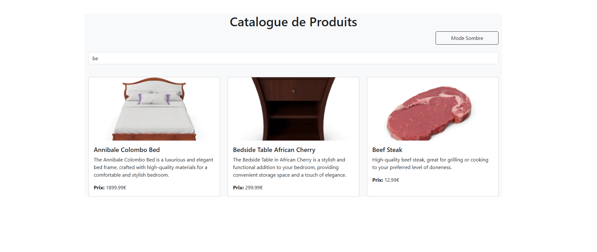
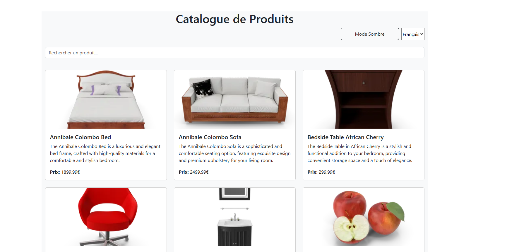
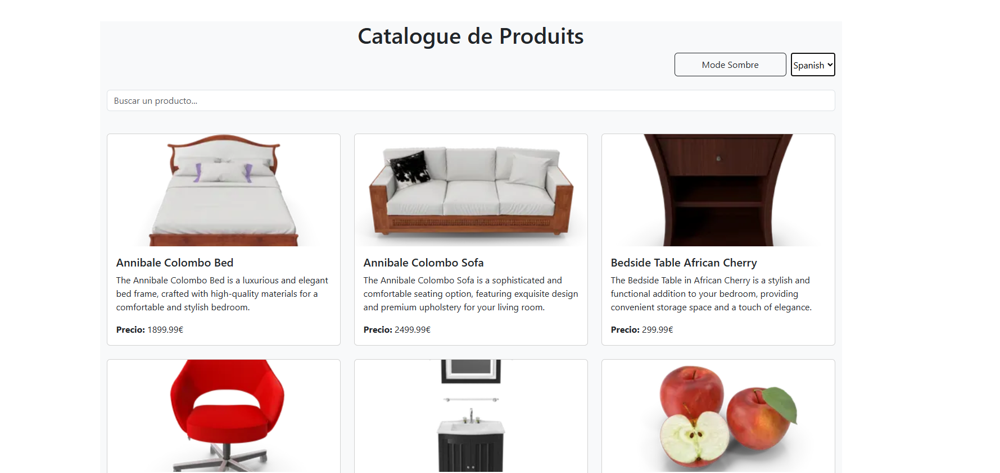
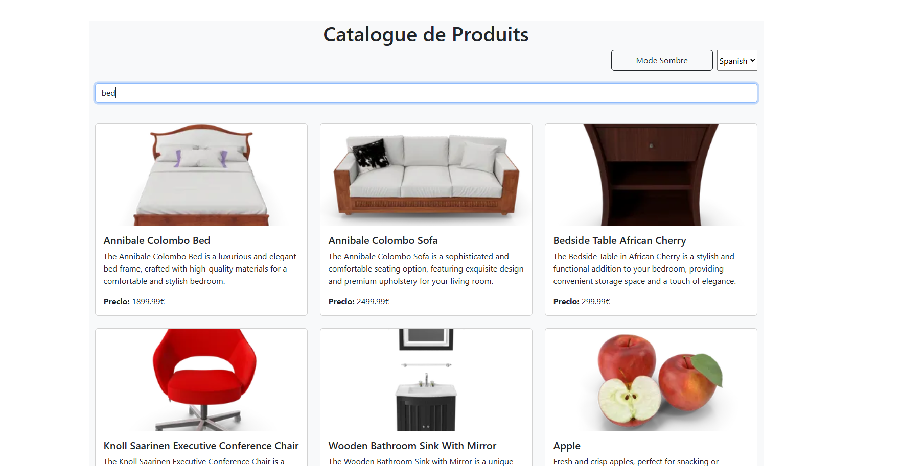
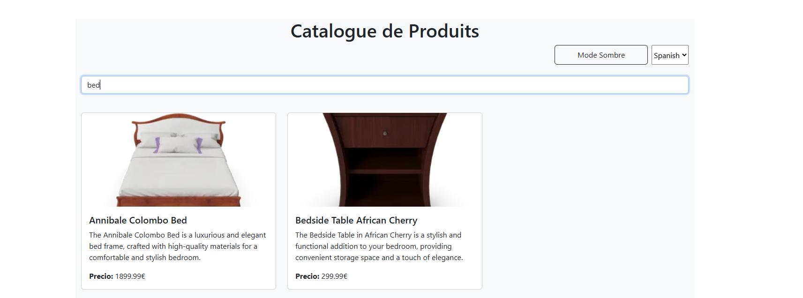
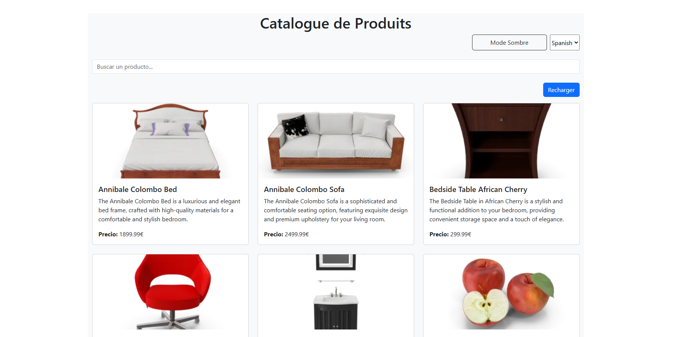
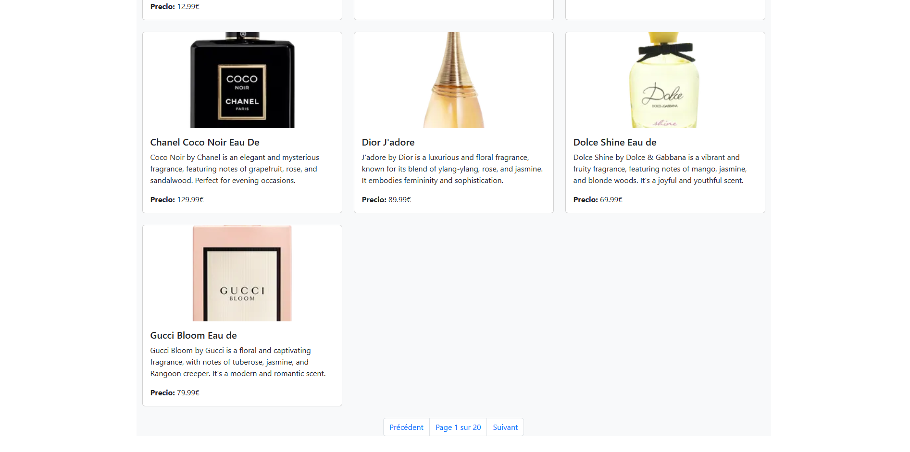
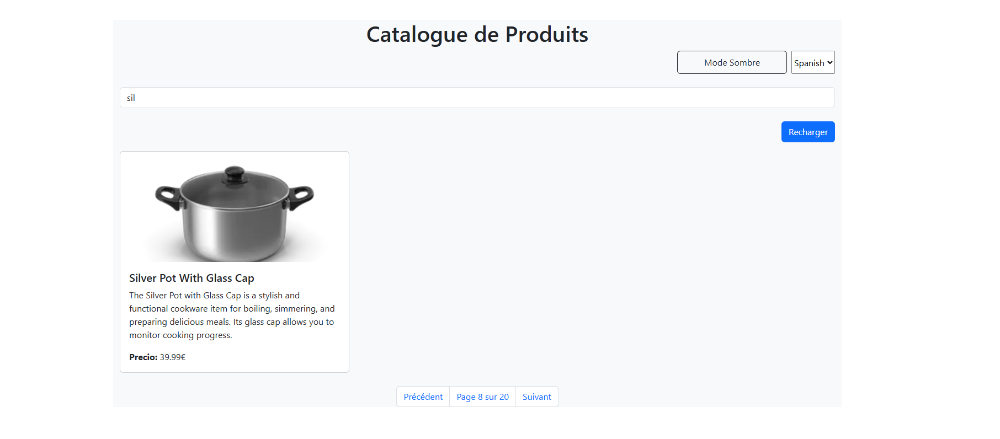

# React Hooks - Application de Gestion de Produits

Ce projet a pour objectif de mettre en pratique l'utilisation des Hooks React (useState, useEffect, useContext) ainsi que la création de Hooks personnalisés.

## Installation et configuration initiale

1. Cloner le dépôt :
```bash
git clone https://github.com/MakhtoutMohamed/react-hooks.git
cd react-hooks
```

2. Créer votre propre dépôt sur Github et changer le remote :
```bash
# Supprimer le remote origine
git remote remove origin

# Ajouter votre nouveau remote
git remote add origin https://github.com/[votre-username]/react-hooks.git

# Premier push
git push -u origin main
```

3. Installer les dépendances :
```bash
npm install
```

4. Lancer l'application :
```bash
npm start
```

## Presentation de projet :
### Exercice 1 : État et Effets 
#### Implémentation d'une recherche en temps réel
Recherche en temp reel:


### Exercice 2 : Context et Internationalisation
#### Gérer les préférences de langue
French:

English:

Spanish:


### Exercice 3 : Hooks Personnalisés
#### Objectif : Créer des hooks réutilisables
Recherche utilisant le debounce:

Debounce apres 3000ms:


### Exercice 4 : Gestion Asynchrone et Pagination
#### Objectif : Gérer le chargement et la pagination
Bouton Recharger:

Chargement des produits:

Pagination:

